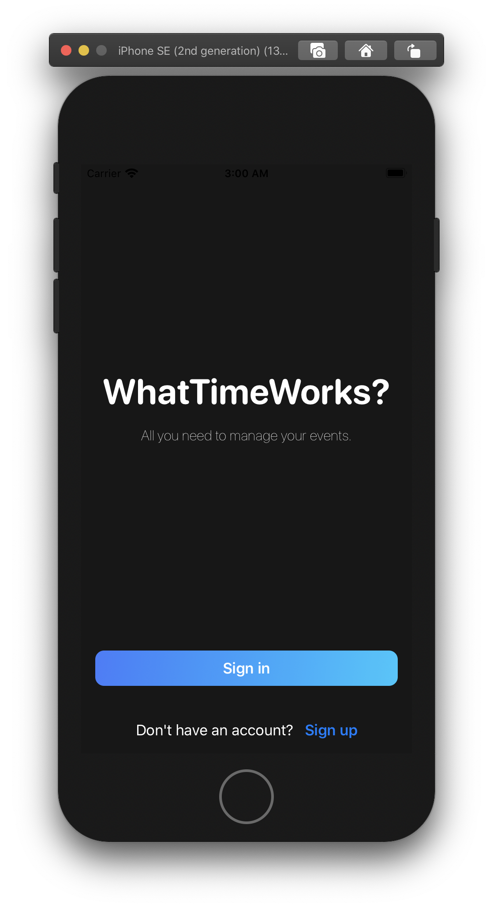
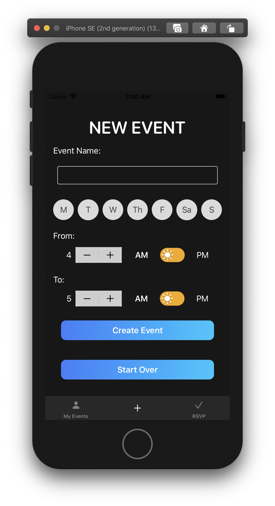
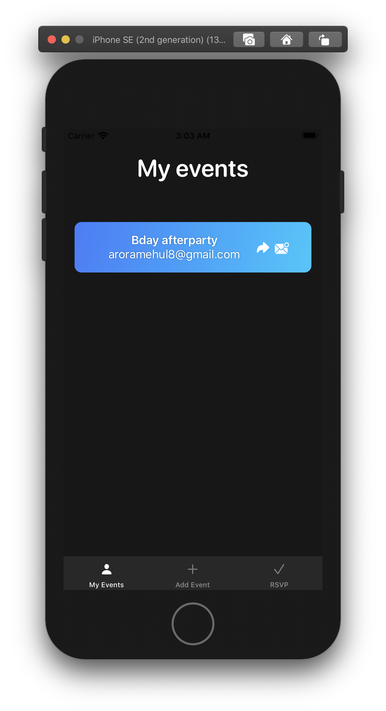
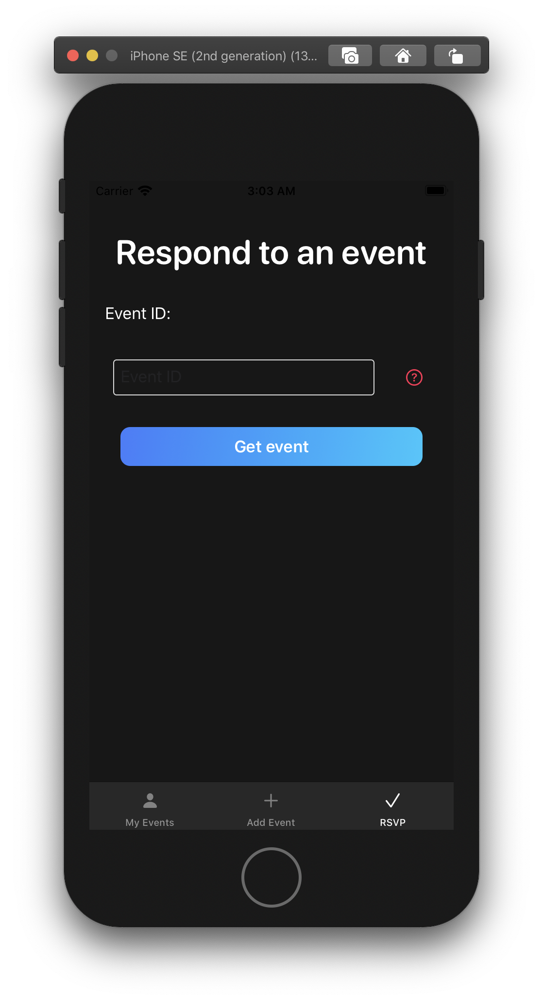
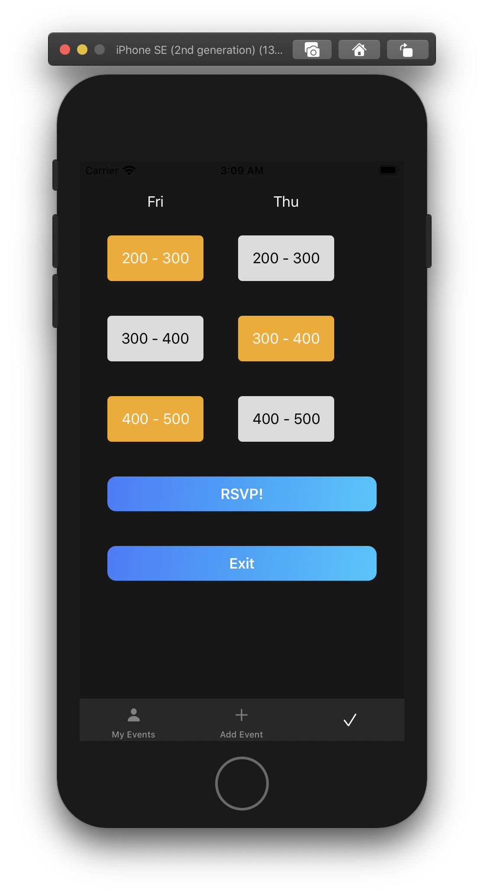

# WhatTimeWorks

WhatTimeWorks is an organization application that helps you get availabilities and schedule events when a large number of people are involved. 

## Create Event:

Add the days that work for you and a time block that you'd like to schedule. That's it!

## See your events: 

As soon as you create an event, it'll be added to the "My Events" tab. Here, you can share the event ID with your friends and also view their responses. 

## Respond to an event:

Once the owner of the event shares the ID of the event with you, you can respond to it by entering it in the RSVP tab. Here, choose the time slots that work for you and that's it!

| Enter Event ID | Choose availabilities |
| ------------- | ------------- |
|   |   |
